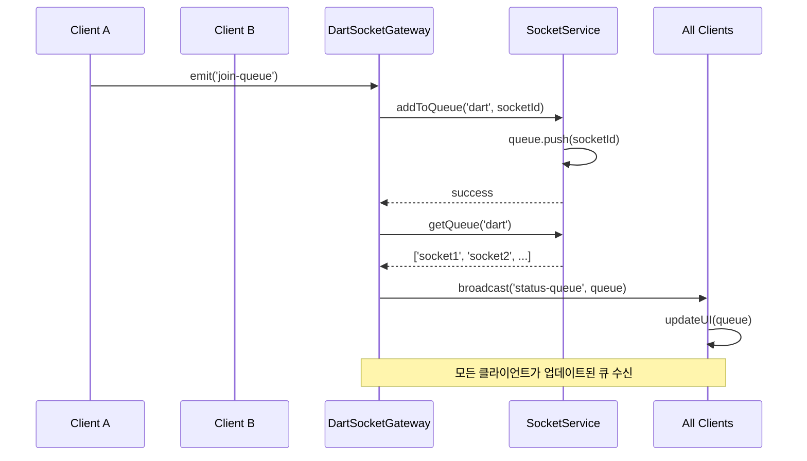
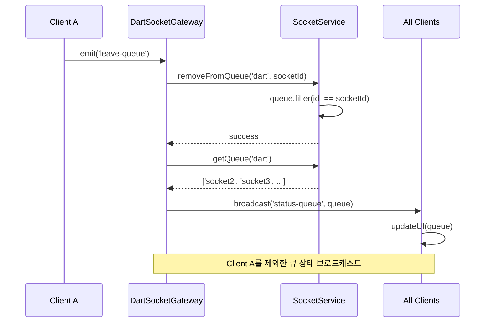
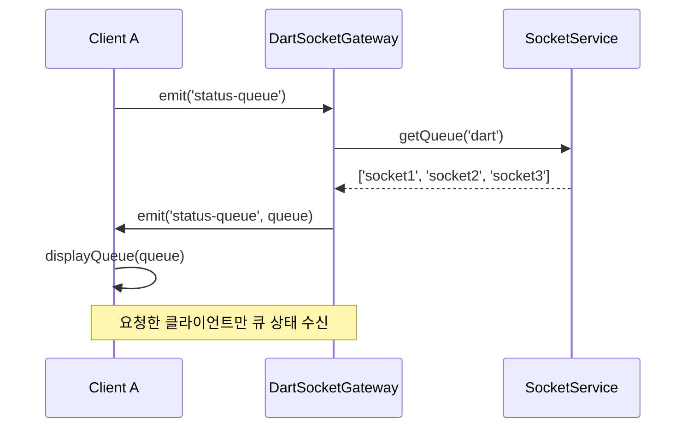
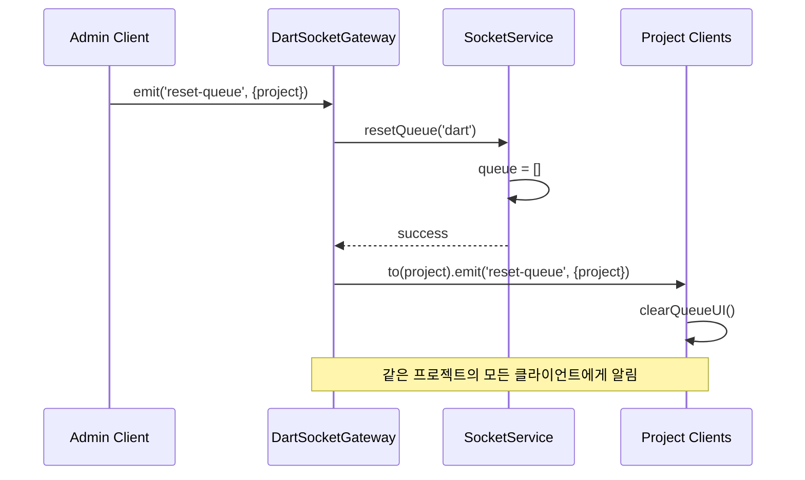
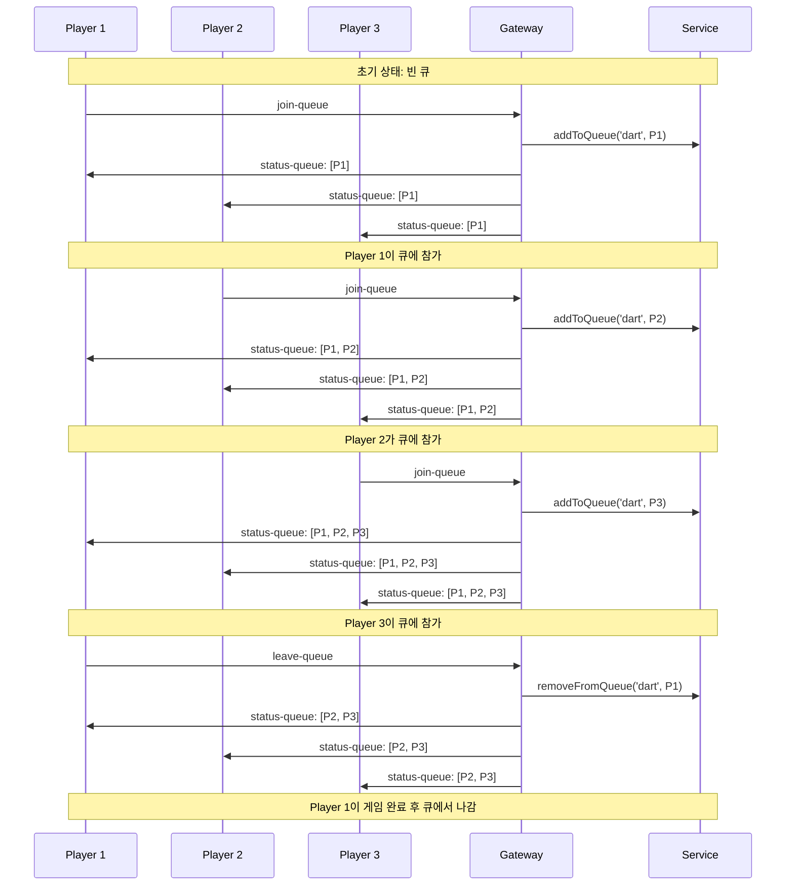
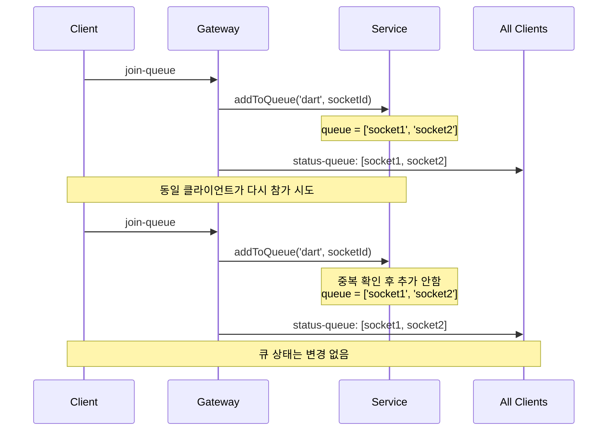
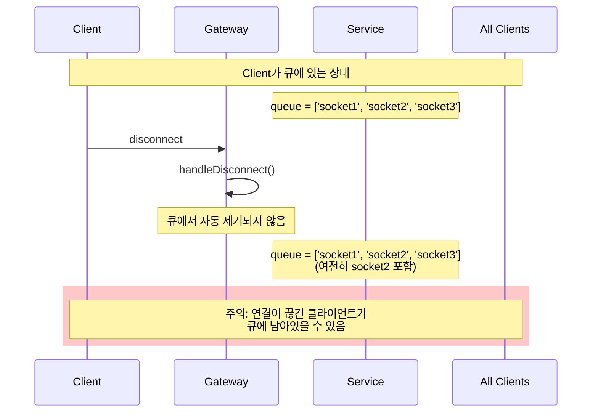
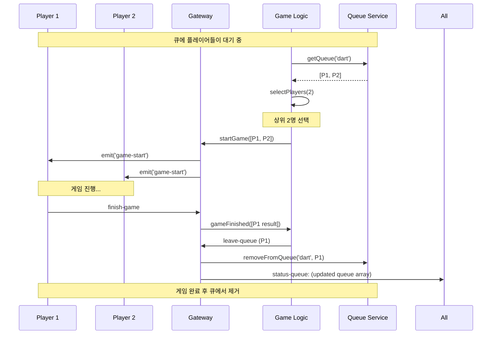

# Dart Queue System - Sequence Diagrams

이 문서는 Dart Queue 시스템의 주요 시나리오에 대한 시퀀스 다이어그램을 포함합니다.

## 1. 큐 참가 (Join Queue)

---

## 2. 큐 나가기 (Leave Queue)

---

## 3. 큐 상태 조회 (Status Queue)

---

## 4. 큐 초기화 (Reset Queue)

---

## 5. 전체 플레이어 흐름 (Complete Player Flow)

---

## 6. 에러 케이스 - 중복 참가 시도

---

## 7. 연결 해제 시나리오 (현재 구현)

---

## 8. 게임 시작 플로우 (권장 패턴)

---

## 다이어그램 렌더링

위의 다이어그램들은 Mermaid 문법으로 작성되었습니다.
다음 도구들에서 렌더링할 수 있습니다:

- **GitHub**: `.md` 파일에서 자동 렌더링
- **VS Code**: Mermaid 확장 프로그램 설치
- **Mermaid Live Editor**: https://mermaid.live/
- **Notion, Confluence** 등 다양한 문서 도구

## 주요 패턴 요약

1. **브로드캐스트 패턴**: `join-queue`, `leave-queue`는 모든 클라이언트에게 상태 전파
2. **유니캐스트 패턴**: `status-queue` 조회는 요청자에게만 응답
3. **프로젝트 기반 브로드캐스트**: `reset-queue`는 특정 프로젝트에만 전송
4. **명시적 제거**: 연결 해제 시 자동 제거되지 않으므로 명시적 호출 필요
